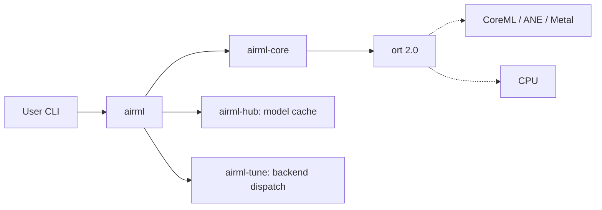

<p align="center">
  
</p>

<p align="center">
  <em>The fastest way to run any ONNX model on Apple Silicon as a single binary.<br>
  No Python, no Docker, no <code>pip install</code>.</em>
</p>

**Documentation:** https://airml.github.io/airml

airML packages ONNX Runtime and a curated set of models into a single native binary. You get sub-50ms cold starts, automatic Apple Neural Engine dispatch, and zero runtime dependencies. Install once, ship anywhere.

[](https://github.com/airml/airml/actions/workflows/ci.yml)
[](https://codecov.io/gh/airml/airml)
[](LICENSE)
[](https://www.rust-lang.org/)
[]()
[]()

<details>
<summary>Architecture overview</summary>



</details>

<p align="center">
  
</p>

## Why airML

| You want to...                                | airML                   | candle | ort       | tract |
|-----------------------------------------------|:-----------------------:|:------:|:---------:|:-----:|
| Ship a 50MB binary that runs ONNX             | yes                     | no     | no        | yes   |
| Use Apple Neural Engine without writing CoreML| yes                     | no     | manual    | no    |
| Auto-pick the best compute units per model    | yes (`airml-tune`)      | no     | no        | no    |
| Skip Python entirely                          | yes                     | yes    | yes (Rust)| yes   |
| Train models                                  | no                      | yes    | no        | no    |
| GPU on NVIDIA                                 | use `candle`            | yes    | yes       | no    |

## Quickstart

```bash
# 1. Install
cargo install --git https://github.com/rlaope/airML

# 2. Install ONNX Runtime in one command
airml install-runtime

# 3. Pull a model and run inference
airml pull bge-small-en
airml run -m bge-small-en --input "Hello, world."
```

## Commands

| Command                   | Purpose                                              |
|---------------------------|------------------------------------------------------|
| `airml install-runtime`   | Auto-download ONNX Runtime dylib (new in 0.2)        |
| `airml pull <model>`      | Cache a model from registry / HuggingFace / URL (new in 0.2) |
| `airml run`               | Inference on an input                                |
| `airml embed`             | Text embedding (with `--features nlp`)               |
| `airml info`              | Inspect a model                                      |
| `airml bench`             | Quick latency benchmark                              |
| `airml generate`          | LLM generation (stub -- coming in 0.3)              |
| `airml serve`             | OpenAI-compatible embeddings HTTP API (v0.5, requires `--features nlp`) |
| `airml system`            | Platform / provider check                            |

See [docs/OBSERVABILITY.md](docs/OBSERVABILITY.md) for logging and metrics.

## HTTP daemon

`airml serve` exposes an [OpenAI-compatible embeddings API](https://platform.openai.com/docs/api-reference/embeddings) so any OpenAI client library works without modification.

```bash
# Build with the nlp feature (required)
cargo build --release --features nlp

# Install ONNX Runtime and pull a model
airml install-runtime
airml pull bge-small-en

# Start the server
airml serve --bind 127.0.0.1:8080

# In another terminal — embed text
curl -s http://127.0.0.1:8080/v1/embeddings \
  -H "Content-Type: application/json" \
  -d '{"model":"bge-small-en","input":["Hello, world."]}' \
  | jq '.data[0].embedding[:5]'
```

### Endpoints

| Method | Path | Description |
|--------|------|-------------|
| `POST` | `/v1/embeddings` | Generate embeddings (OpenAI-compatible) |
| `GET`  | `/v1/models` | List registry models |
| `GET`  | `/v1/embeddings/info?model=<id>` | Cache status for a model |
| `GET`  | `/healthz` | Health check — always `{"status":"ok"}` |

### Options

```
--bind <host:port>           Bind address (default: 127.0.0.1:8080)
--default-model <id>         Model used when request omits "model" field
--auth-token <token>         Require Bearer token on /v1/* routes
--max-request-bytes <bytes>  Request body size limit (default: 4 MiB)
--cache-dir <path>           Override Hub cache directory
```

## Apple Silicon: the auto-tuner

`airml-tune` profiles your model and picks the right CoreML compute units automatically:

| Model class                      | Auto pick          | Reason                                         |
|----------------------------------|--------------------|------------------------------------------------|
| Vision (Conv-heavy)              | ANE only           | ANE excels at conv                             |
| Text encoder, static shapes      | ANE only           | Best ANE throughput                            |
| Text encoder, dynamic shapes     | All compute units  | Let CoreML decide per shape                    |
| Image+Text dual                  | All compute units  | Mixed workload                                 |
| Language model (KV cache)        | GPU only           | ANE struggles with autoregressive control flow |

Override with `--provider {cpu,coreml,neural-engine,auto}`. Default is `auto`.

## Models we love

| ID                    | Source               | Use case             | Size    |
|-----------------------|----------------------|----------------------|---------|
| `bge-small-en`        | BAAI                 | Text embedding       | 133 MB  |
| `all-minilm-l6-v2`   | sentence-transformers| Text embedding       | 90 MB   |
| `clip-vit-b32`        | Xenova/CLIP          | Image+text           | 605 MB  |
| `mobilenetv3-small`   | onnx/models          | Image classification | 14 MB   |
| `whisper-tiny-encoder`| Xenova/Whisper       | Audio encoder        | 80 MB   |

`airml pull --list` for the latest registry.

## Performance

> Reproducible benchmarks live under [`crates/airml-bench/`](crates/airml-bench/).
> The numbers below come from `cargo bench -p airml-bench` on M2 Pro / macOS 14.

| Provider            | Model       | Latency | Throughput  |
|---------------------|-------------|---------|-------------|
| CPU                 | ResNet50    | _       | _           |
| CoreML (All)        | ResNet50    | _       | _           |
| Neural Engine       | ResNet50    | _       | _           |

> Help wanted! Run benchmarks on your hardware and PR results to `bench/results/`.

Comparison to Python baseline (cold start, ~50MB binary vs ~2GB Python environment):

| Metric         | airML      | Python (PyTorch) |
|----------------|------------|------------------|
| Binary size    | ~50 MB     | ~2 GB            |
| Cold start     | 0.01-0.05s | 2-5s             |
| Memory usage   | ~100 MB    | ~500 MB+         |

## Install

### macOS (Apple Silicon) -- recommended

```bash
# 1. Download airml
curl -L https://github.com/rlaope/airML/releases/latest/download/airml-macos-aarch64.tar.gz | tar xz
sudo mv airml /usr/local/bin/

# 2. Install ONNX Runtime (new preferred path)
airml install-runtime

# Or manually:
curl -L https://github.com/microsoft/onnxruntime/releases/download/v1.23.1/onnxruntime-osx-arm64-1.23.1.tgz | tar xz -C /usr/local/lib
export ORT_DYLIB_PATH=/usr/local/lib/onnxruntime-osx-arm64-1.23.1/lib/libonnxruntime.dylib
```

### macOS (Intel)

```bash
curl -L https://github.com/rlaope/airML/releases/latest/download/airml-macos-x86_64.tar.gz | tar xz
sudo mv airml /usr/local/bin/

curl -L https://github.com/microsoft/onnxruntime/releases/download/v1.23.1/onnxruntime-osx-x86_64-1.23.1.tgz | tar xz -C /usr/local/lib
export ORT_DYLIB_PATH=/usr/local/lib/onnxruntime-osx-x86_64-1.23.1/lib/libonnxruntime.dylib
```

### Linux (x86_64)

```bash
curl -L https://github.com/rlaope/airML/releases/latest/download/airml-linux-x86_64.tar.gz | tar xz
sudo mv airml /usr/local/bin/

curl -L https://github.com/microsoft/onnxruntime/releases/download/v1.23.1/onnxruntime-linux-x64-1.23.1.tgz | tar xz -C /usr/local/lib
export ORT_DYLIB_PATH=/usr/local/lib/onnxruntime-linux-x64-1.23.1/lib/libonnxruntime.so
```

### From source

```bash
git clone https://github.com/rlaope/airML.git
cd airML
cargo build --release --features coreml,nlp
```

### Verify installation

```bash
airml system
```

## Using as a library

```rust
use airml_core::{InferenceEngine, SessionConfig};
use airml_preprocess::ImagePreprocessor;
use airml_providers::CoreMLProvider;

fn main() -> anyhow::Result<()> {
    let providers = vec![CoreMLProvider::default().neural_engine_only().into_dispatch()];
    let config = SessionConfig::new().with_providers(providers);

    let mut engine = InferenceEngine::from_file_with_config("model.onnx", config)?;

    let input = ImagePreprocessor::imagenet().load_and_process("image.jpg")?;
    let outputs = engine.run(input.into_dyn())?;

    Ok(())
}
```

Embed a model directly into your binary:

```rust
use airml_embed::EmbeddedModel;

static MODEL: &[u8] = include_bytes!("model.onnx");

fn main() -> anyhow::Result<()> {
    let engine = EmbeddedModel::new(MODEL).into_engine()?;
    // use engine...
    Ok(())
}
```

## Deploy

Ship airML in production with Docker, systemd, or Homebrew. See the full
[Deployment Guide](docs/DEPLOYMENT.md) for Docker Compose, AWS Lambda ARM,
and platform notes.

**One-line Docker example:**

```bash
docker run --rm -p 8080:8080 airml/airml:0.2 serve --bind 0.0.0.0:8080
```

## Anti-goals (what we don't do)

- We don't compete with `candle` on CUDA -- use `candle`.
- We don't train models -- use `burn`.
- We don't ship a Python binding (this is the point).
- We don't host an iOS/Android SDK -- server/desktop CLI focused.
- We don't expand the registry beyond ~20 curated models.

## Roadmap

See [ROADMAP.md](ROADMAP.md). v0.2 is shipping the auto-tuner + model registry; v0.3 lands LLM generation with KV cache.

## Examples

See [examples/](examples/). Each is < 100 LOC and runs with `cargo run --example <name>`.

## Contributing

See [CONTRIBUTING.md](CONTRIBUTING.md).

## License

MIT -- see [LICENSE](LICENSE) for details.
