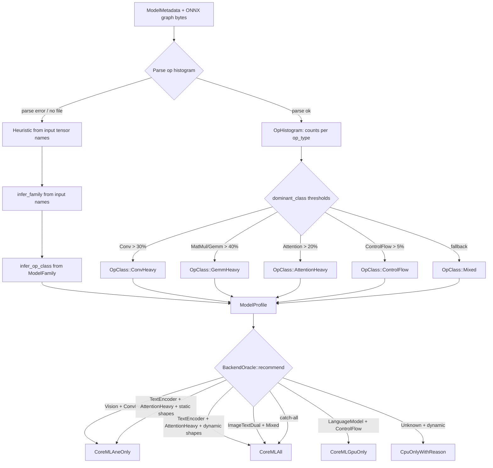

# Auto-Tuner Internals

`airml-tune` contains a stateless `BackendOracle` that maps model characteristics to a `BackendRecommendation` without running any benchmarks.

## Two classification paths

**Metadata path** (`profile_from_metadata`): uses input tensor names and shapes only. Fast — no file I/O. Input names like `pixel_values`, `input_ids`, or `attention_mask` map directly to `ModelFamily` variants, which are then mapped to `OpClass`.

**Graph path** (`profile_from_path`): reads the raw ONNX protobuf and counts every `NodeProto.op_type` without pulling in `prost` or requiring `protoc`. The resulting `OpHistogram` applies fractional thresholds to determine `OpClass`. This path is more accurate for models with unusual input naming.

For best results, combine both: call `profile_from_metadata` to get family and dynamic-shape info, then patch `dominant_op_class` from the histogram if the model file is available.
