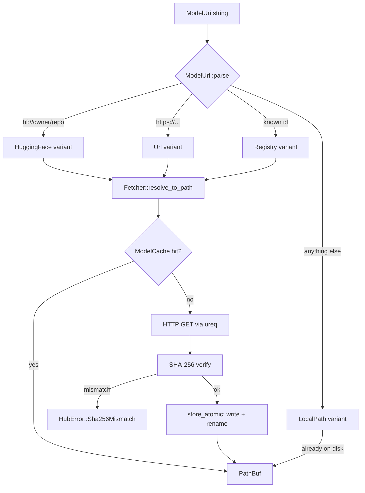

# Hub & Cache

`airml-hub` provides zero-friction model acquisition. A single `ModelUri` string covers four source types: built-in registry IDs, HuggingFace repositories, arbitrary HTTPS URLs, and local paths.

## Content-addressed storage

Every blob is stored at `<cache_root>/<sha256[0..2]>/<sha256>`, following Git's fanout layout. This means:

- **Deduplication is automatic.** Two URIs pointing to the same model bytes share one cache entry.
- **Integrity is guaranteed.** `store_atomic` verifies the SHA-256 digest before the rename; a partial download can never enter the cache.
- **Eviction is safe.** Removing the file at its canonical path is the only operation needed; no index to update.

The default cache root is `~/Library/Caches/airml/models` on macOS and `~/.cache/airml/models` on Linux, following the XDG base directory spec via the `dirs` crate.
