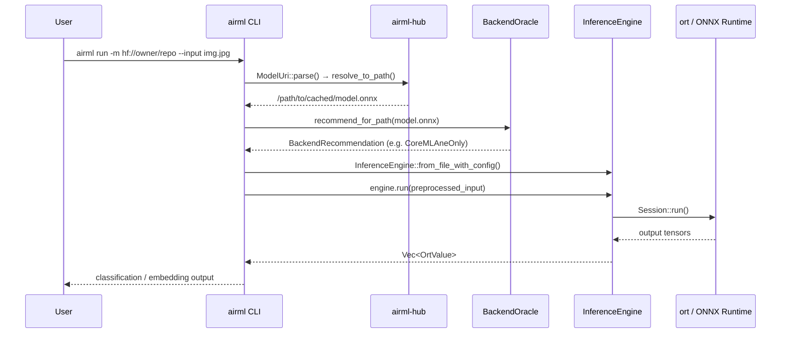

# Inference Flow

This sequence diagram shows the complete request lifecycle for `airml run`, from the user's command line through to output.

## Key design decisions

**Model resolution is synchronous.** `Fetcher::resolve_to_path` either returns a cached path instantly or blocks on an HTTP download. There is no async runtime; the CLI is a short-lived process where simplicity beats throughput.

**Backend selection happens before session creation.** The `BackendOracle` reads the ONNX graph op histogram *before* the ORT session is opened, so the session is configured with the correct providers from the start. There is no runtime provider fallback.

**Preprocessing is separate from inference.** `ImagePreprocessor` and `TextPreprocessor` live in `airml-preprocess` and return plain `ndarray` arrays. `InferenceEngine::run` accepts any `OrtValue`-compatible input, keeping the inference path provider-agnostic.
