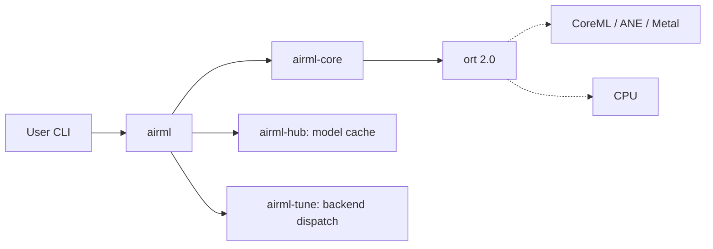

# Architecture Overview

airML is a multi-crate Rust workspace designed around a single principle: zero runtime dependencies for the end user. ONNX Runtime is linked statically and distributed as part of the binary, so there is nothing to install beyond the `airml` executable itself.

The workspace is split into focused crates, each owning a narrow slice of responsibility. The CLI (`src/`) wires them together at the top level, delegating to `airml-hub` for model acquisition, `airml-tune` for backend selection, `airml-core` for inference, and `airml-preprocess` for input preparation.

Hardware acceleration is entirely opt-in via Cargo feature flags. The `coreml` feature enables Apple Neural Engine dispatch through `airml-providers`; omitting it falls back to CPU silently. This keeps the binary lean on platforms where CoreML is unavailable.

See the following pages for a deeper look at each layer:

- [Workspace topology](workspace.md) — crate dependency graph
- [Inference flow](inference-flow.md) — request lifecycle from CLI to ORT
- [Auto-tuner internals](auto-tuner.md) — how `airml-tune` picks compute units
- [Hub & cache](hub.md) — content-addressed model storage
