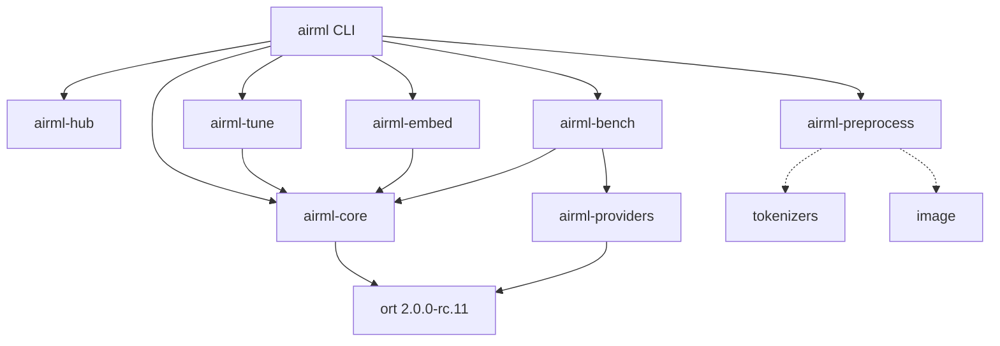

# Workspace Topology

The airML workspace contains seven crates. Solid arrows indicate `[dependencies]` entries; dashed arrows indicate optional or feature-gated dependencies.

## Crate responsibilities

| Crate | Responsibility |
|---|---|
| `airml-core` | `InferenceEngine`, `SessionConfig`, `ModelMetadata` — wraps ORT sessions |
| `airml-hub` | Content-addressed model download and caching (`ModelUri`, `Fetcher`, `ModelCache`) |
| `airml-tune` | Backend oracle and auto-tuner (`BackendOracle`, `OpHistogram`, graph parser) |
| `airml-preprocess` | Image and text preprocessing (`ImagePreprocessor`, `TextPreprocessor`) |
| `airml-embed` | Utilities for embedding ONNX models in Rust binaries at compile time |
| `airml-bench` | Latency benchmarking (`BenchRunner`, statistics) |
| `airml-providers` | Execution provider abstraction (`CpuProvider`, `CoreMLProvider`) |

`airml-core` and `airml-providers` are the only crates that link against ORT. All others stay ORT-free, which keeps compile times short for library consumers that only need model acquisition or preprocessing.
