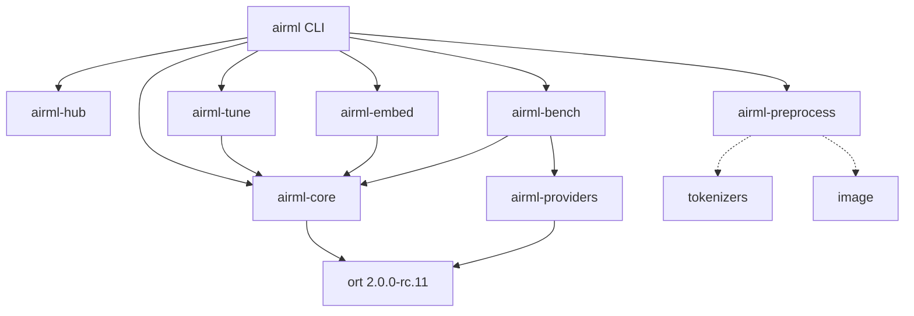
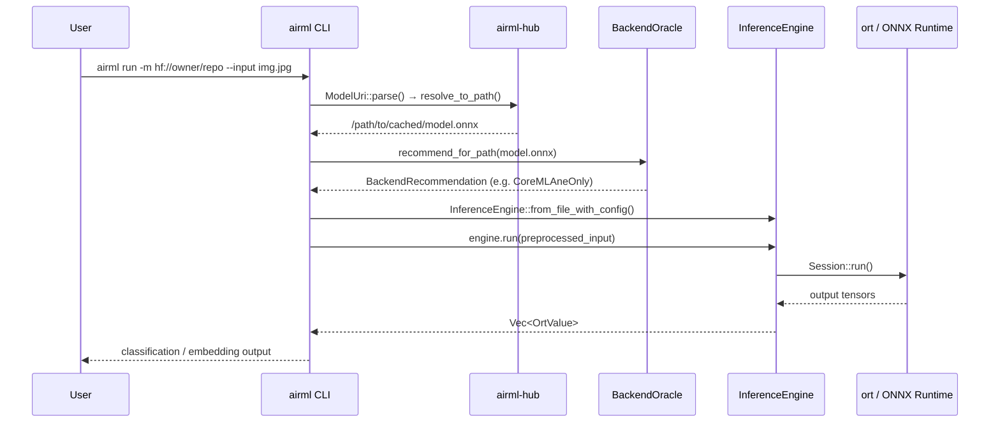
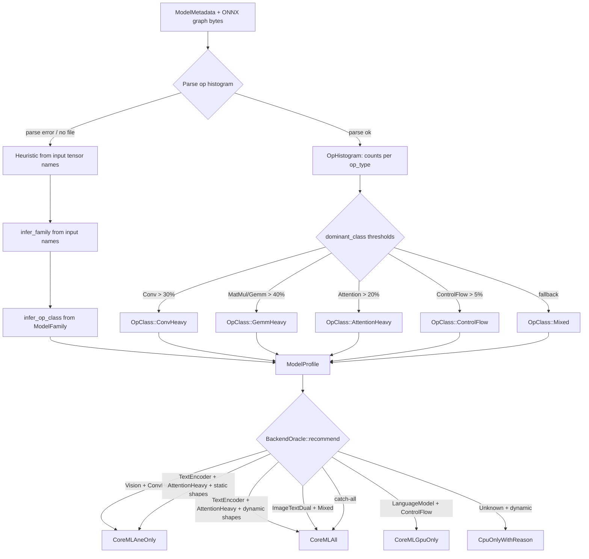

# airML Architecture

This document explains the internal architecture of airML.

## Workspace Topology



## Inference Flow



## Auto-Tuner Decision Tree



## Overview

airML is a lightweight ML inference runtime built in Rust. It provides a CLI for running ONNX models without Python dependencies.

```
┌─────────────────────────────────────────────────────────────┐
│                        airML CLI                            │
│  (run, info, bench, system, embed commands)                 │
└─────────────────────────────────────────────────────────────┘
                              │
              ┌───────────────┼───────────────┐
              ▼               ▼               ▼
┌─────────────────┐  ┌─────────────────┐  ┌─────────────────┐
│   airml-core    │  │ airml-preprocess│  │ airml-providers │
│                 │  │                 │  │                 │
│ • InferenceEngine  │ • ImagePreprocessor  │ • CpuProvider     │
│ • SessionConfig │  │ • TextPreprocessor   │ • CoreMLProvider  │
│ • ModelMetadata │  │ • TokenizedInput│  │ • ComputeUnits  │
└─────────────────┘  └─────────────────┘  └─────────────────┘
              │               │               │
              └───────────────┼───────────────┘
                              ▼
                    ┌─────────────────┐
                    │       ort       │
                    │  (ONNX Runtime) │
                    └─────────────────┘
```

## Crates

### airml-core

The core inference engine that wraps ONNX Runtime.

**Key Components:**

- `InferenceEngine` - Main interface for loading and running models
- `SessionConfig` - Configuration for ORT sessions (threads, optimization level, providers)
- `ModelMetadata` - Model information (inputs, outputs, name)
- `TensorInfo` - Tensor shape and dtype information

**Flow:**

```
Model File (.onnx)
       │
       ▼
┌─────────────────┐
│ InferenceEngine │
│ ::from_file()   │
└─────────────────┘
       │
       ▼
┌─────────────────┐
│  ORT Session    │
│  (internal)     │
└─────────────────┘
       │
       ▼
engine.run(input) → outputs
```

### airml-preprocess

Input preprocessing for images and text.

**Image Preprocessing:**

```rust
let preprocessor = ImagePreprocessor::imagenet();
let tensor = preprocessor.load_and_process("image.jpg")?;
// tensor: [1, 3, 224, 224] f32
```

**Presets:**

| Preset | Size | Mean | Std |
|--------|------|------|-----|
| ImageNet | 224x224 | [0.485, 0.456, 0.406] | [0.229, 0.224, 0.225] |
| CLIP | 224x224 | [0.481, 0.458, 0.408] | [0.269, 0.261, 0.276] |
| YOLO | 640x640 | [0, 0, 0] | [1, 1, 1] |

**Text Preprocessing (NLP feature):**

```rust
let preprocessor = TextPreprocessor::from_file("tokenizer.json")?
    .with_max_length(512);
let tokenized = preprocessor.encode("Hello world")?;
// tokenized.input_ids: [101, 7592, 2088, 102, 0, 0, ...]
// tokenized.attention_mask: [1, 1, 1, 1, 0, 0, ...]
```

### airml-providers

Execution provider abstraction for hardware acceleration.

**Available Providers:**

| Provider | Feature Flag | Hardware |
|----------|--------------|----------|
| CPU | (default) | Any |
| CoreML | `coreml` | Apple Silicon |

**CoreML ComputeUnits:**

```rust
// Use all available hardware (CPU + GPU + Neural Engine)
CoreMLProvider::default()

// Optimize for Neural Engine
CoreMLProvider::default().neural_engine_only()

// Use GPU only (no ANE)
CoreMLProvider::default().gpu_only()

// CPU only (for debugging)
CoreMLProvider::default().cpu_only()
```

### airml-embed

Utilities for embedding models in Rust binaries.

```rust
use airml_embed::EmbeddedModel;

static MODEL: &[u8] = include_bytes!("model.onnx");

fn main() {
    let engine = EmbeddedModel::new(MODEL).into_engine()?;
}
```

## Data Flow

### Image Classification

```
┌──────────┐    ┌─────────────────┐    ┌─────────────────┐    ┌──────────┐
│  Image   │───▶│ImagePreprocessor│───▶│ InferenceEngine │───▶│ Softmax  │
│ (JPEG)   │    │                 │    │                 │    │ + Top-K  │
└──────────┘    └─────────────────┘    └─────────────────┘    └──────────┘
                      │                        │
                      ▼                        ▼
               [1,3,224,224]            [1,1000] logits
```

### Text Embedding

```
┌──────────┐    ┌─────────────────┐    ┌─────────────────┐    ┌──────────┐
│  Text    │───▶│ TextPreprocessor│───▶│ InferenceEngine │───▶│ Pooling  │
│ (String) │    │                 │    │                 │    │ + L2 Norm│
└──────────┘    └─────────────────┘    └─────────────────┘    └──────────┘
                      │                        │
                      ▼                        ▼
              [1,512] input_ids         [1,seq,768] or
              [1,512] attention_mask    [1,768] embedding
```

## CLI Commands

### run

Executes model inference on input.

```
run command
    │
    ├── select_providers() → providers
    ├── InferenceEngine::from_file_with_config()
    ├── create_preprocessor() → ImagePreprocessor
    ├── preprocessor.load_and_process()
    ├── engine.run()
    └── print_classification_output() or print_raw_output()
```

### bench

Benchmarks inference performance.

```
bench command
    │
    ├── InferenceEngine::from_file_with_config()
    ├── create_random_input()
    ├── warmup: N iterations (results discarded)
    ├── benchmark: N iterations (times recorded)
    └── calculate_stats() → mean, median, p50/90/95/99, throughput
```

### embed

Generates text embeddings.

```
embed command
    │
    ├── TextPreprocessor::from_file()
    ├── InferenceEngine::from_file_with_config()
    ├── preprocessor.encode()
    ├── engine.run() or engine.run_multiple()
    ├── extract_embeddings() → mean pooling if 3D
    ├── l2_normalize() (optional)
    └── print_json() or print_raw()
```

## Feature Flags

| Flag | Description | Dependencies |
|------|-------------|--------------|
| `cpu` | CPU execution (default) | - |
| `coreml` | CoreML/Metal acceleration | macOS only |
| `nlp` | Text preprocessing | tokenizers crate |

## Error Handling

All errors are wrapped in `AirMLError`:

```rust
pub enum AirMLError {
    ModelNotFound(String),
    ModelLoadError(String),
    InferenceError(String),
    PreprocessError(String),
    ConfigError(String),
    OrtError(String),
}
```

## Thread Configuration

```rust
let config = SessionConfig::new()
    .with_intra_threads(4)  // Threads within an operator
    .with_inter_threads(2); // Threads between operators
```

## Optimization Levels

```rust
pub enum OptimizationLevel {
    None,    // No optimization
    Basic,   // Basic graph optimizations
    Extended,// Extended optimizations
    All,     // All optimizations (default)
}
```
